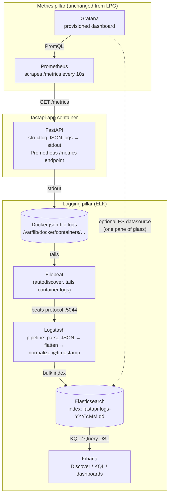

# FastAPI Observability — ELK Stack Edition

FastAPI with structured JSON logging shipped into the **ELK stack** (**E**lasticsearch + **L**ogstash + **K**ibana, with **Filebeat** as the shipping agent), plus **Prometheus + Grafana** for metrics.

This is the sibling of the [`fastapi-with-lpg`](../fastapi-with-lpg) project (Loki + Promtail + Grafana). The `app/` code is intentionally **identical** — it proves your application is decoupled from the logging backend. Only the shipping/storage/UI layer changes:

| Concern | LPG version | This version |
|---|---|---|
| Log shipper | Promtail | Filebeat |
| Log processing | (minimal, in Promtail) | Logstash pipeline |
| Log storage/query | Loki | Elasticsearch |
| Log UI | Grafana Explore | Kibana Discover |
| Metrics | Prometheus + Grafana | Prometheus + Grafana (unchanged) |

> **Why keep Prometheus + Grafana?** ELK is a log platform, not a metrics time-series engine. "ELK for logs + Prometheus/Grafana for metrics" is a very common real-world pairing. See `PRD.md` for the full rationale and deep-dive.

## Architecture



**Data flow:** FastAPI writes one JSON object per log line to stdout → Docker captures it in the container's log file → Filebeat tails that file and forwards each line to Logstash → Logstash parses the JSON, flattens the fields to the top level, sets `@timestamp`, and bulk-indexes into a daily `fastapi-logs-*` index → Kibana queries Elasticsearch. Metrics never touch ELK: Prometheus scrapes `/metrics` directly and Grafana graphs it.

## Project structure

```
fastapi-withy-elk/
├── app/
│   ├── main.py                  # app factory, middleware + router wiring
│   ├── api/routes.py            # /api/v1/items, /api/v1/external, /health
│   ├── core/
│   │   ├── config.py            # pydantic-settings, reads .env
│   │   ├── logging.py           # structlog JSON config + service/env stamping
│   │   └── metrics.py           # prometheus-fastapi-instrumentator + custom metrics
│   ├── middleware/
│   │   ├── correlation.py       # X-Request-ID correlation IDs
│   │   ├── logging.py           # access-log middleware (method/path/status/duration)
│   │   └── metrics.py           # educational hand-rolled alternative (not wired in)
│   └── services/example.py      # demo business logic emitting logs + metrics
├── monitoring/
│   ├── elasticsearch/elasticsearch.yml
│   ├── logstash/
│   │   ├── logstash.yml
│   │   └── pipeline/fastapi.conf   # beats input → JSON parse/flatten → ES output
│   ├── filebeat/filebeat.yml       # Docker autodiscover → Logstash
│   ├── kibana/kibana.yml
│   ├── prometheus/prometheus.yml
│   └── grafana/provisioning/       # datasources + FastAPI Overview dashboard
├── Dockerfile                      # uv-based image
├── docker-compose.yml              # app + ES + Logstash + Filebeat + Kibana + Prometheus + Grafana
├── pyproject.toml                  # uv-managed, package = false
├── .env
└── PRD.md                          # the full written guide this project implements
```

## Setup with uv

```bash
# install uv once, if you don't have it
curl -LsSf https://astral.sh/uv/install.sh | sh

# install dependencies (creates .venv + honors uv.lock)
uv sync

# run the app standalone (no observability stack)
uv run uvicorn app.main:app --reload --port 8000
```

Packages: `fastapi`, `uvicorn[standard]`, `structlog`, `prometheus-fastapi-instrumentator`, `pydantic-settings`, `asgi-correlation-id` (dev: `pytest`, `httpx`, `ruff`). The app needs **no Elasticsearch client** — from the app's point of view, logging is just JSON on stdout; Filebeat and Logstash do the rest.

## Run the full stack

```bash
docker compose up --build -d

# ELK takes noticeably longer to become healthy than Loki did
docker compose ps
docker compose logs -f elasticsearch   # wait for cluster health yellow/green

# generate some traffic
for i in $(seq 1 20); do
  curl -s -X POST localhost:8001/api/v1/items \
       -H 'Content-Type: application/json' -d "{\"name\": \"widget-$i\"}" > /dev/null
  curl -s localhost:8001/api/v1/external > /dev/null   # ~10% simulated failures → 502s
done
```

Container names carry an `-elk` suffix and host ports are shifted so this stack can run **side by side** with the `fastapi-with-lpg` stack (which keeps 8000/9090/3000):

| Service | Container | URL | Notes |
|---|---|---|---|
| App (Swagger) | `fastapi-app-elk` | http://localhost:8001/docs | container port stays 8000 |
| Kibana | `kibana-elk` | http://localhost:5601 | log exploration |
| Elasticsearch | `elasticsearch-elk` | http://localhost:9200 | API only, no auth (local) |
| Logstash | `logstash-elk` | :5044 (beats) | no UI |
| Filebeat | `filebeat-elk` | — | log shipper |
| Prometheus | `prometheus-elk` | http://localhost:9091 | |
| Grafana | `grafana-elk` | http://localhost:3001 | `admin` / `admin` |

### One-time Kibana data view

Kibana needs a *data view* pointing at the log indices. Either click through **☰ → Stack Management → Data Views → Create data view** (name `fastapi-logs`, pattern `fastapi-logs-*`, time field `@timestamp`), or create it via API:

```bash
curl -s -X POST http://localhost:5601/api/data_views/data_view \
  -H 'Content-Type: application/json' -H 'kbn-xsrf: true' \
  -d '{"data_view": {"title": "fastapi-logs-*", "name": "fastapi-logs", "timeFieldName": "@timestamp"}}'
```

Then open **☰ → Discover** and pick the `fastapi-logs` data view.

## Querying logs

**KQL** (Kibana Discover search bar):

```
level: "error"
duration_ms > 200
status_code >= 500
request_id: "3f1c9e2a-..."
level: "error" and service: "fastapi-observability-elk"
```

**Elasticsearch Query DSL** (Kibana Dev Tools or `curl localhost:9200`):

```json
GET fastapi-logs-*/_search
{
  "query": {
    "bool": {
      "filter": [
        { "term": { "status_code": 500 } },
        { "range": { "@timestamp": { "gte": "now-1h" } } }
      ]
    }
  },
  "sort": [{ "@timestamp": "desc" }],
  "size": 20
}
```

**Cross-tool workflow to practice:** spot an error spike in Grafana → note the time window → open Kibana Discover with `status_code >= 500` in that window → grab a `request_id` → filter to it and read that request's whole story.

## Querying metrics (PromQL, unchanged from LPG)

```promql
sum(rate(http_requests_total[5m])) by (handler)

sum(rate(http_requests_total{status=~"5.."}[5m]))
  / sum(rate(http_requests_total[5m])) * 100

histogram_quantile(0.95,
  sum(rate(http_request_duration_seconds_bucket[5m])) by (le, handler))
```

## Gotchas hit while building this (so you don't)

- **`metrics.default()` already includes request count + latency metrics.** Adding `metrics.requests()` / `metrics.latency()` on top (as some tutorials do) crashes at startup with *"Duplicated timeseries in CollectorRegistry"*.
- **Kibana 8 rejects `xpack.security.enabled` in `kibana.yml`** — that's an Elasticsearch setting; putting it in Kibana's config makes Kibana refuse to boot with an "unknown setting" error.
- **Logstash 8 renamed `http.host` → `api.http.host`** in `logstash.yml`.
- **Filebeat needs `user: root` + `--strict.perms=false`** to read Docker's log files and socket on Docker Desktop.
- **Startup ordering matters much more than with Loki**: Logstash and Kibana crash-loop if Elasticsearch isn't up yet, hence the ES `healthcheck` + `depends_on: condition: service_healthy` in the compose file.
- **ELK is RAM-hungry**: ES and Logstash are JVMs. Heaps are capped small here (512m / 256m) for laptop use.
- **Filebeat's `add_docker_metadata` bloats every document** with ~15 compose labels under `docker.*` and `container.labels.*`. The Logstash `mutate` filter strips them, keeping only `container.name`.
- **Docker container names are host-global, not per-project.** Two compose projects can't both create a container named `fastapi-app` — and a *stopped* container still reserves its name. Hence the `-elk` suffix on every `container_name` here, shifted host ports (8001/9091/3001), and a Filebeat condition matching `fastapi-app-elk` exactly so it never ingests the LPG app's logs when both stacks run together.

## Going further

See `PRD.md` for the full guide, including index templates/mappings (keyword vs text fields), ILM retention policies, and production considerations (security, clustering, heap sizing, snapshots, Elastic Agent).
